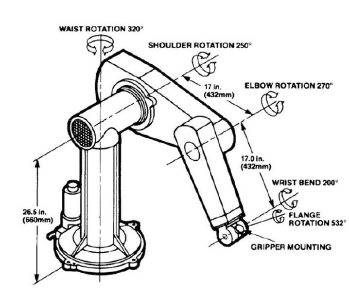

  
  
    

# PUMA 560 Kinematics Project
## Introduction
The main objective of this project is to calculate kinematics and inverse kinematics of the PUMA 560 robot that is given below.  

The PUMA 560 manipulator is a 5DOF (Degrees of Freedom) manipulator. The initial three revolute joints are similar to the elbow manipulator. The last two revolute joints are part of spherical wrist. The standard spherical wrist has 3DOF. However, the spherical wrist for this project has only 2 DOF.  

For the forward kinematic equations, the Denavit-Hartenberg (DH) Convention was used to come up with the ai (link length), di (link offset), alphai (link twist), and thetai (joint variables) parameters. I wanted to design a PUMA 560 application that would take inputs from a user and output either forward or the inverse kinematic calculation results. The app designer from Matlab R2019b was used for this program. The program would calculate the forward or inverse kinematic parameters and tabulate them if requested by the user.  

For the inverse kinematics portion, an analytical approach was used in coming up with the joint variable equations. Each of the joint angles have rotational constraints which are taken into consideration in this program.

## Project Application
The image below shows the final product of the PUMA560 program that would calculate forward and inverse kinematics.  

